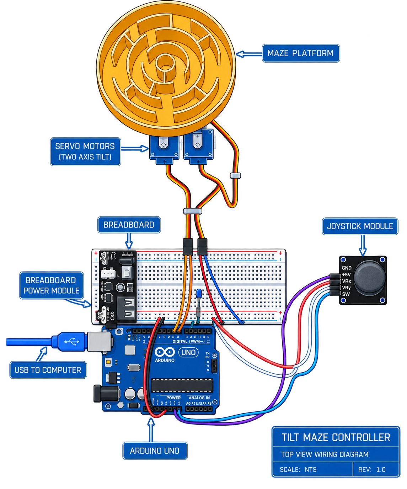
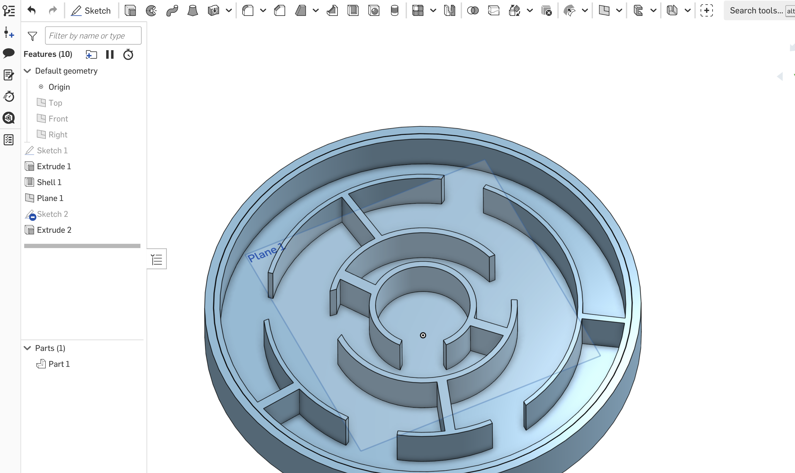

# Joystick-Controlled Arduino Maze

## Project Inspiration

For this project, I wanted to build on my existing knowledge of Arduino, breadboards, digital and analog inputs, and basic coding. I had seen many cool videos online where people used a joystick to control a tilting maze, and I wanted to try to replicate the idea using skills and components that I had already practiced.

My goal was to create a physical maze that could be controlled using a joystick. Moving the joystick left and right would control one servo motor, while moving it up and down would control another. By combining the movement of the two servos, I would be able to tilt the maze in different directions and eventually guide a ball through it.

---

## Setting Up the Joystick

The first part of my project was getting the joystick to communicate with the Arduino Uno R3.

The joystick has five pins:

- **GND → Ground**
- **+5V → 5V**
- **VRx → A0**
- **VRy → A1**
- **SW → Digital Pin 2**

`VRx` measures the horizontal movement of the joystick, while `VRy` measures the vertical movement. Since these are analog inputs, the Arduino reads their positions as values from approximately **0 to 1023**.

The `SW` pin is different because it is a digital input. The joystick can also be pressed downward like a button, and the SW pin allows the Arduino to detect that press.

I also connected the **5V pin and GND pin from the Arduino Uno R3 to the positive and negative rails of the breadboard**. This allowed the Arduino to provide power through the breadboard so that multiple components could share the same power and ground connections.

<!-- INSERT CIRCUIT / BLUEPRINT IMAGE HERE -->



(Here is just another look of a blueprint - it is AI generated but I took the picture of my own circuit and told it to resemble the picture in a clearer way)

---

## Adding a Blue LED Indicator

I also added a **blue LED** to help me test whether the joystick button and circuit were responding properly.

The joystick's `SW` pin was connected to **digital pin 2**, while the blue LED was connected to **digital pin 7**.

I added a **220 Ω resistor in series with the LED**. The resistor limits the current flowing through the LED so that too much current does not pass through it and damage or overheat it.

In my program, I used:

```cpp
int ledPin = 7;
int buttonPin = 2;
```

Then I set up the joystick button using Arduino's internal pull-up resistor:

```cpp
pinMode(buttonPin, INPUT_PULLUP);
pinMode(ledPin, OUTPUT);
```

Using `INPUT_PULLUP` means that the button normally reads `HIGH`. When I press down on the joystick, the SW pin reads `LOW`.

My code then checks for that:

```cpp
buttonState = digitalRead(buttonPin);

if (buttonState == LOW) {
  digitalWrite(ledPin, HIGH);
}
```

This meant that when I pressed down on the joystick, the blue LED turned on. This gave me a quick visual way to confirm that power was reaching the circuit and that the Arduino was successfully detecting the joystick button.

---

## Connecting the Servo Motors

After the joystick was working, I added two servo motors.

One servo controls movement along the **X-axis**, while the second servo controls movement along the **Y-axis**.

The signal wires for the two servos were connected to:

- **X-axis servo → Digital Pin 9**
- **Y-axis servo → Digital Pin 10**

The power and ground connections for the servos were connected through the breadboard.

In my code, I first included Arduino's Servo library:

```cpp
#include <Servo.h>
```

Then I created two servo objects:

```cpp
Servo xServo;
Servo yServo;
```

I also assigned the servo pins:

```cpp
int xServoPin = 9;
int yServoPin = 10;
```

Inside `setup()`, I connected each servo object to its Arduino pin:

```cpp
xServo.attach(xServoPin);
yServo.attach(yServoPin);
```

This allowed the Arduino to send position commands to both servo motors.

---

## Converting Joystick Movement Into Servo Movement

The most important part of my code happens inside the `loop()` function.

First, the Arduino continuously reads the horizontal and vertical positions of the joystick:

```cpp
xVal = analogRead(xPin);
yVal = analogRead(yPin);
```

The joystick produces values between approximately **0 and 1023**.

However, I did not want my servos rotating through their full range because that would tilt the maze much too far. Instead, I only wanted each servo to move through a relatively small angle.

To do this, I used Arduino's `map()` function:

```cpp
xServoPos = map(xVal, 0, 1023, 0, 30);
yServoPos = map(yVal, 0, 1023, 0, 30);
```

This takes the joystick's range from `0–1023` and converts it into a servo position between `0° and 30°`.

After calculating the new position, I sent the values to the servos:

```cpp
xServo.write(xServoPos);
yServo.write(yServoPos);
```

This meant that moving the joystick horizontally changed the position of one servo, while moving it vertically changed the position of the other servo.

When both servos work together, they create movement in two different directions.

---

## Testing the Controls

Before building the actual maze, I tested the joystick and servo system by itself.

I moved the joystick **up, down, left, and right** and watched how the two motors responded. This helped me confirm that the analog joystick values were being converted into the correct servo movements before I added the weight of the maze.

<!-- INSERT VIDEO OF JOYSTICK CONTROLLING THE TWO SERVOS HERE -->
<video style="width:100%; max-width:700px;" controls>
  <source src="videos/IMG_1673.mp4" type="video/mp4">
</video>

<!--
Example if your video is uploaded to a videos folder:

<video width="700" controls>
  <source src="videos/servo-test.mp4" type="video/mp4">
</video>
-->

---

## Designing the Maze in CAD

Once I had the electronics working, I moved on to designing the physical part of the project.

I used CAD to design both the maze itself and the anchoring system underneath it. The anchoring system was important because the two servos needed to physically tilt the maze along two different axes.

My original maze design had a diameter of approximately **25 cm**.

At first, I thought that making the maze larger would make the project more interesting and give the ball more room to move.

<!-- INSERT 25 CM CAD IMAGE HERE -->



<!-- INSERT IMAGE OF FIRST PRINTED MAZE / FIRST PROTOTYPE HERE -->


---

## My First Major Problem

After printing the 25 cm maze and attaching it to the servo system, I discovered a major problem.

The maze was **way too large and heavy** for the two servo motors.

When I originally tested the servos without the maze attached, they were able to move easily. However, once the large maze was placed on top of them, the motors had to support much more weight.

The two servos could not properly hold and tilt the entire 25 cm maze.

This was an important moment in my design process because the electronic system worked, but the complete physical system did not.

Instead of continuing to force the original design to work, I decided that I needed to redesign the maze itself.

---

## Redesigning the Maze

I went back into CAD and created a much smaller version.

Instead of a diameter of **25 cm**, my new maze had a diameter of approximately **12 cm**.

<!-- INSERT 12 CM CAD IMAGE HERE -->


<!-- INSERT IMAGE OF THE SMALLER PRINTED MAZE HERE -->


Reducing the size made the maze significantly lighter, which meant that the servo motors did not have to support as much weight.

The smaller design was much more realistic for the amount of force that my servo motors could produce.

---

## Building the Two-Axis Mechanism

After printing the smaller maze, I began connecting everything together.

I attached the two servo motors underneath the maze in a **zigzag/perpendicular arrangement**.

One servo controls one direction of tilt, while the second servo controls the other direction.

This allows the maze to move:

- left and right
- forward and backward

When the two servo movements are combined, I can control the overall tilt of the maze using the joystick.

<!-- INSERT IMAGE OF ZIGZAG SERVO ASSEMBLY HERE -->


---

## Final Build

After redesigning the maze, assembling the two-axis servo system, connecting the electronics, and testing the joystick again, I was finally able to create a working joystick-controlled maze.

The final project combines:

- Arduino Uno R3
- Analog joystick
- Two servo motors
- Blue LED
- 220 Ω resistor
- Breadboard
- CAD-designed maze
- 3D-printed components
- Arduino code
- A two-axis tilting mechanism

The joystick acts as the input. The Arduino reads the X and Y values, converts those values into servo positions, and then sends commands to the two motors.

The result is that I can physically control the direction of the maze by moving the joystick.

<!-- INSERT FINAL PROJECT VIDEO HERE -->

<!--
<video width="700" controls>
  <source src="videos/final-maze.mp4" type="video/mp4">
</video>
-->

---

## Final Arduino Code

```cpp
#include <Servo.h>

int ledPin = 7;
int xPin = A0;
int yPin = A1;
int buttonPin = 2;

int xVal;
int yVal;
int buttonState;

int xServoPin = 9;
int yServoPin = 10;

int xServoPos;
int yServoPos;

Servo xServo;
Servo yServo;

void setup() {

  pinMode(xPin, INPUT);
  pinMode(yPin, INPUT);
  pinMode(buttonPin, INPUT_PULLUP);
  pinMode(ledPin, OUTPUT);

  xServo.attach(xServoPin);
  yServo.attach(yServoPin);
}

void loop() {

  xVal = analogRead(xPin);
  yVal = analogRead(yPin);
  buttonState = digitalRead(buttonPin);

  // Converts joystick values into servo positions

  xServoPos = map(xVal, 0, 1023, 0, 30);
  yServoPos = map(yVal, 0, 1023, 0, 30);

  xServo.write(xServoPos);
  yServo.write(yServoPos);

  if (buttonState == LOW) {
    digitalWrite(ledPin, HIGH);
  }
}
```

---

## Component Research

For this project, one of the components I had to learn more about was the **servo motor and Arduino Servo library**. I researched how a servo receives a signal from an Arduino, how to use `Servo.attach()`, and how to control its angle using `Servo.write()`.

**Source:**  
[ADD THE WEBSITE / VIDEO / TUTORIAL YOU ACTUALLY USED HERE]
